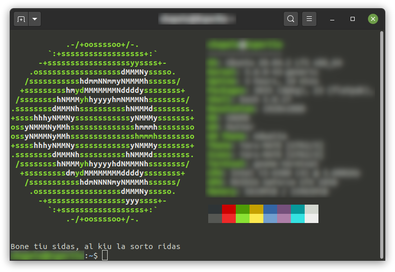

# ProverbaroMontrilo
Promgrameto por Montri Hazardan Lineon el la Proverbaro

## Bezonaĵoj

- Python (mi uzis version trian)

## Uzado

Rulu terminale la programeton per:

```shell
$ python proverbo.py
```

Por montri plurajn proverbojn, oni povas skribi entjeran kvanton kiel komandlinian argumenton, ekzemple:

```shell
 $ python proverbo.py 10
```

Mi kreis ĉi tiun programeton por montri proverbaranon, kiam nova terminala fenestro estas malfermita. En baŝo (*bash*) oni povas fari ĉi tion per la aldono al `~/.bashrc` de lineo kiel:

```bash
python $HOME/user/git/ProverbaroMontrilo/proverbo.py
```

Memoru ŝanĝi la dosierindikon al la loko ĝusta por la propra komputilo.

## Ekzemplo

<p align="center">
  
</p>

Ekzemplo de nova terminala fenestro kun rulo de [Neofetch](https://github.com/dylanaraps/neofetch) kaj ProverbaroMontrilo.

### Agnosko

Dankon al www.proverbaro.net pro la fonto de la proverboj.